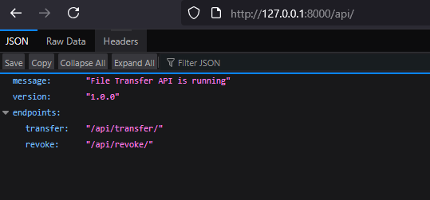
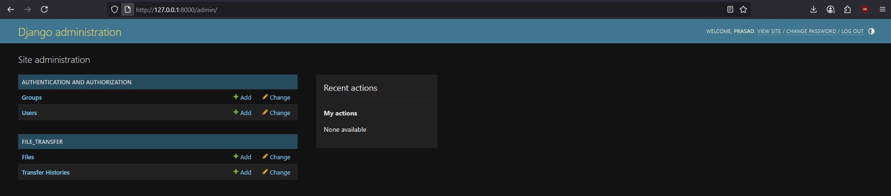
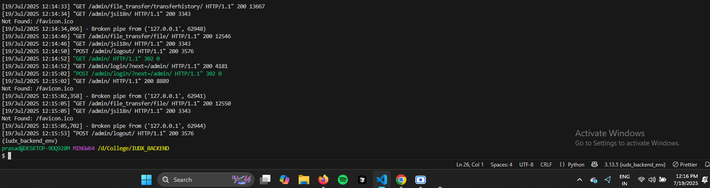

# Screenshots

Below are screenshots demonstrating various backend operations of the project:

  
*This screenshot shows the initial state of the backend server after starting, indicating successful setup and readiness to handle requests.*

  
*This screenshot captures the process of uploading or transferring a file, displaying the API endpoint being accessed and the server's response.*

This is the screenshot of the server requests we did while demonstration in the video:

  
*This screenshot highlights the server's activity during the demonstration, showing multiple requests being handled and

## Demo Video

[Click here to watch the demo video](./screen-capture(1).webm)
